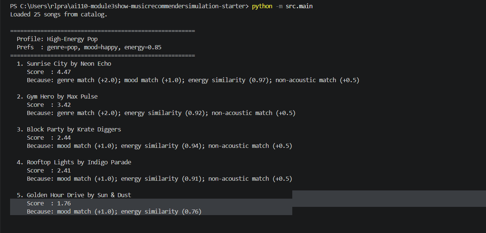
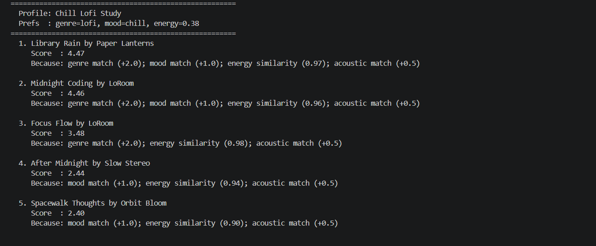
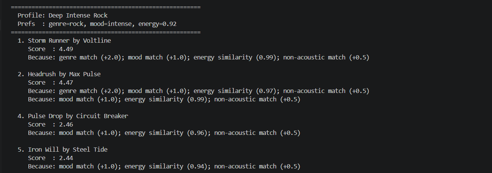

# Music Recommender Simulation

## Project Summary

This project simulates how a content-based music recommendation system works. Given a catalog of 25 songs (each described by genre, mood, energy, tempo, valence, danceability, and acousticness), the system scores every song against a user's taste profile and returns the top-ranked matches. The simulation demonstrates how simple weighted rules can produce surprisingly "personal-feeling" suggestions — and shows where those rules can break down.

---

## How The System Works

### Real-World Context

Platforms like Spotify use a blend of two main strategies. **Collaborative filtering** finds users with similar listening histories and recommends what they liked. **Content-based filtering** ignores other users entirely and matches the properties of songs to the properties the current user prefers — things like genre, tempo, mood, and energy level. This project implements a simplified version of content-based filtering.

### Features Used

Each `Song` object stores:
- `genre` — e.g., pop, rock, lofi, electronic
- `mood` — e.g., happy, chill, intense, sad
- `energy` — float 0.0–1.0 (how energetic the track feels)
- `tempo_bpm` — beats per minute
- `valence` — float 0.0–1.0 (musical positivity)
- `danceability` — float 0.0–1.0
- `acousticness` — float 0.0–1.0

Each `UserProfile` stores:
- `favorite_genre` — the genre the user prefers most
- `favorite_mood` — the mood the user prefers most
- `target_energy` — the energy level the user wants
- `likes_acoustic` — whether the user prefers acoustic vs. produced sound

### Algorithm Recipe

For every song in the catalog the system computes:

| Rule | Points |
|------|--------|
| Genre matches user's favorite | +2.0 |
| Mood matches user's favorite | +1.0 |
| Energy closeness (`1.0 - abs(song_energy - target_energy)`) | 0.0–1.0 |
| Acoustic preference matches (`acousticness > 0.6` or `< 0.4`) | +0.5 |

Songs are then sorted from highest to lowest score and the top 5 are returned.

### Data Flow

```
User Profile (genre, mood, energy, likes_acoustic)
        |
        v
For each Song in songs.csv  →  score_song()  →  (score, reasons)
        |
        v
Sort all (song, score, reasons) by score descending
        |
        v
Return top-k recommendations with explanation
```

### Known Bias

Genre is worth 2.0 points — twice any other category. This means a genre match almost always outranks non-genre songs regardless of mood or energy. If the catalog has many songs in one genre, that genre's songs will dominate every profile that lists it as a favorite.

---

## Getting Started

### Setup

1. Create a virtual environment (optional but recommended):

   ```bash
   python -m venv .venv
   source .venv/bin/activate      # Mac / Linux
   .venv\Scripts\activate         # Windows
   ```

2. Install dependencies:

   ```bash
   pip install -r requirements.txt
   ```

3. Run the recommender:

   ```bash
   python -m src.main
   ```

### Running Tests

```bash
pytest
```

---

## Terminal Output

Running `python -m src.main` produces ranked recommendations for three test profiles. 







```
Loaded 25 songs from catalog.

=======================================================
  Profile: High-Energy Pop
  Prefs  : genre=pop, mood=happy, energy=0.85
=======================================================
  1. Sunrise City by Neon Echo
     Score  : 4.47
     Because: genre match (+2.0); mood match (+1.0); energy similarity (0.97); non-acoustic match (+0.5)

  2. Gym Hero by Max Pulse
     Score  : 3.42
     Because: genre match (+2.0); energy similarity (0.92); non-acoustic match (+0.5)
...
```

---

## Experiments

### Weight Shift: Halving Genre Weight

When genre weight was reduced from 2.0 to 1.0, mood and energy had more influence. The "High-Energy Pop" profile started surfacing hip-hop and electronic tracks that matched mood/energy better than a pop track that matched genre but was low energy. This showed that genre dominance is a design choice, not an inevitability.

### Feature Removal: Mood Disabled

Removing the mood check collapsed variety — every profile converged toward whichever genres were closest in energy, ignoring the emotional tone entirely. This confirmed that mood is load-bearing even at only 1.0 points.

### Edge Case Profile — Conflicting Preferences

Testing `energy: 0.9, mood: sad` (high intensity but sad tone) produced intense rock and metal tracks. The system has no way to model the tension between "loud but sad" — it treats features as additive rather than holistic.

---

## Limitations and Risks

- The catalog is tiny (25 songs); genres like classical, blues, and soul are absent entirely.
- Genre bias: a 2.0-point genre bonus means genre almost always controls the top result.
- No tempo, valence, or danceability are used in scoring — those features are loaded but ignored.
- The system cannot learn; it applies the same weights to every user forever.
- No diversity mechanism — the same artist can fill all 5 recommendation slots.

---

## Reflection

See [model_card.md](model_card.md) for the full model card and personal reflection.
